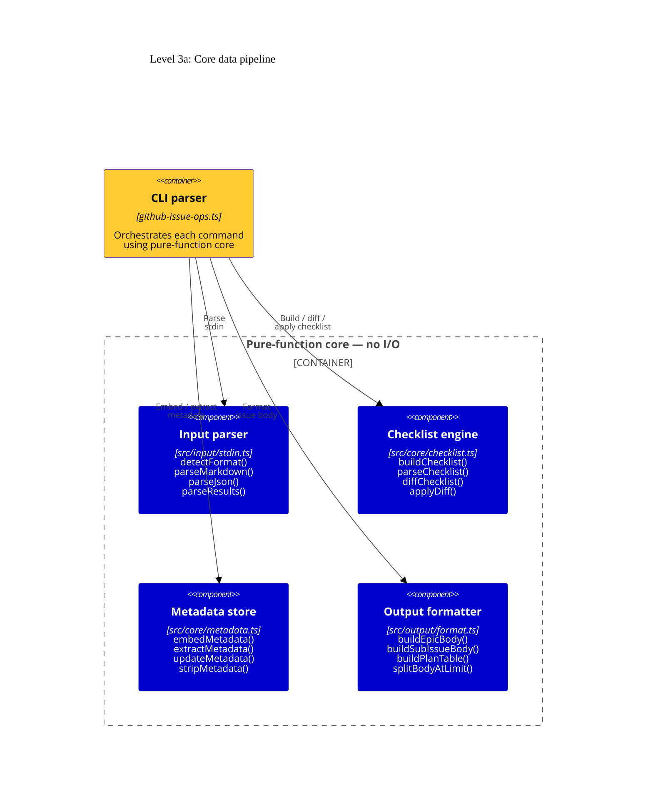
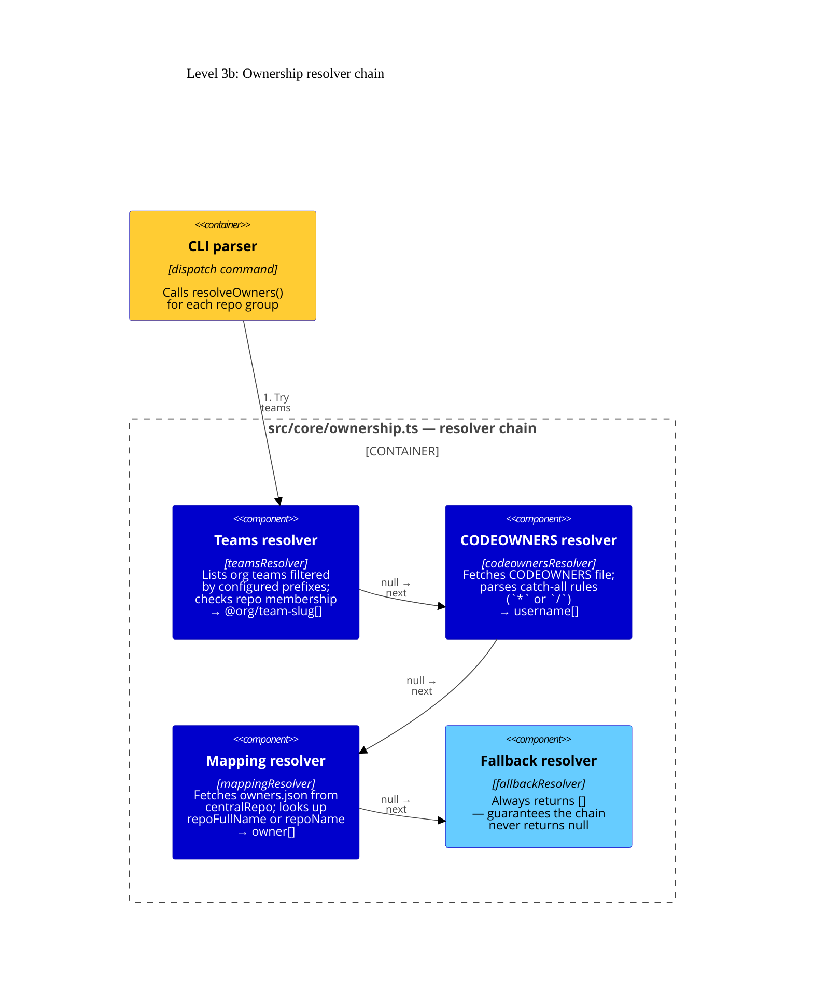

# Level 3: Components

The pure-function core is split into two focused diagrams: the **core data pipeline**
(input → checklist → metadata → output) and the **ownership resolver chain**.
Every component in the pipeline is side-effect-free and fully unit-tested.

## 3a — Core data pipeline

Pure functions that transform raw input into structured issue bodies.

## 3b — Ownership resolver chain

The pluggable resolver chain used by `resolveOwners()` to determine assignees per repository.
Each resolver is a pure async function; the first returning a non-null array wins.

## Component descriptions

| Component               | Source file             | Key exports                                                                                                                                                                                                                        |
| ----------------------- | ----------------------- | ---------------------------------------------------------------------------------------------------------------------------------------------------------------------------------------------------------------------------------- |
| **Input parser**        | `src/input/stdin.ts`    | `detectFormat()` — JSON or Markdown; `parseMarkdown()` — parses checklist + replay block; `parseJson()` — 3 formats: flat array, wrapper object, github-code-search groups.                                                        |
| **Checklist engine**    | `src/core/checklist.ts` | `buildChecklist()` — results → Markdown; `parseChecklist()` — Markdown → items; `diffChecklist()` — old vs new; `applyDiff()` — update body in-place; `BODY_LIMIT = 65_000`.                                                       |
| **Metadata store**      | `src/core/metadata.ts`  | `embedMetadata()` — appends `<!-- github-issue-ops:metadata … -->` block; `extractMetadata()` — parses it back; `updateMetadata()` — updates a field; `stripMetadata()` — removes the comment.                                     |
| **Output formatter**    | `src/output/format.ts`  | `buildEpicBody()` — full EPIC Markdown with checklist + summary; `buildSubIssueBody()` — per-repo issue body listing files; `buildPlanTable()` — dispatch plan as ASCII table; `splitBodyAtLimit()` — splits body at `BODY_LIMIT`. |
| **Teams resolver**      | `src/core/ownership.ts` | Lists all org teams matching `teamPrefixes`, then checks which have the target repo. Returns `["@org/team"]` slugs or `null`.                                                                                                      |
| **CODEOWNERS resolver** | `src/core/ownership.ts` | Fetches `CODEOWNERS`, `.github/CODEOWNERS`, `docs/CODEOWNERS`. Parses only catch-all rules (`*` or `/` patterns). Returns usernames or `null`.                                                                                     |
| **Mapping resolver**    | `src/core/ownership.ts` | Fetches `.github-issue-ops/owners.json` from `centralRepo`. Looks up `repoFullName` then `repoName`. Returns owners or `null`.                                                                                                     |
| **Fallback resolver**   | `src/core/ownership.ts` | Always returns `[]`. Ensures `resolveOwners()` never returns `null`.                                                                                                                                                               |

## Design principles

- **No I/O.** Every component in the core and output layers is a pure function: given the same inputs it always returns the same outputs. This makes them straightforward to test with Bun's built-in test runner.
- **Single responsibility.** Each module owns exactly one concern (parsing, checklist, metadata, …). The CLI parser composes them at command time rather than duplicating logic.
- **`types.ts` as the contract.** All components share interfaces from `src/types.ts` (`SearchResult`, `ParsedResults`, `ChecklistItem`, `DiffResult`, `EpicMetadata`, `DispatchGroup`, `OwnershipResolver`, …).
- **Body limit protected.** `BODY_LIMIT = 65_000` is a hard constant used by every body-building function. `splitBodyAtLimit()` and `checkBodyLength()` are the enforcement points.
