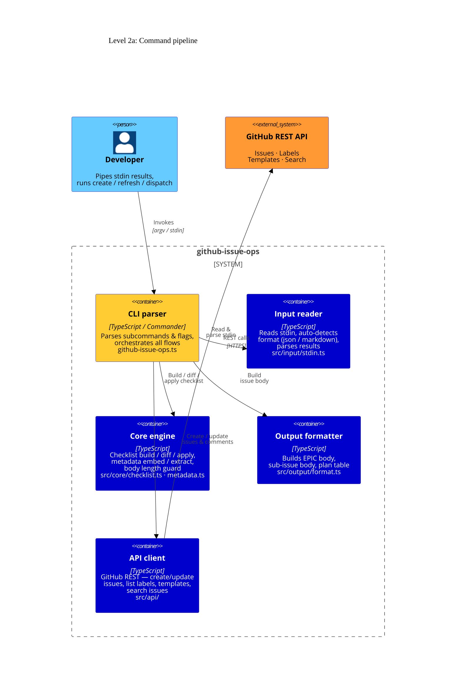
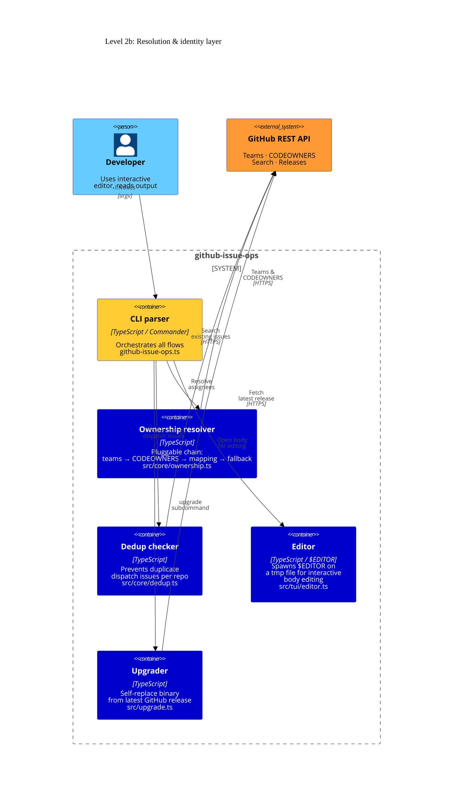

# Level 2: Containers

The containers are split across two focused diagrams to keep relations readable.
Each arrow has a single, clear crossing-free path.

## 2a — Command pipeline

How a command flows from `stdin` through parsing, core logic, and API calls to GitHub.

## 2b — Resolution & identity layer

Supporting services: ownership resolution, dedup, interactive editor, self-upgrade.

## Container descriptions

| Container              | Source file(s)                           | Responsibility                                                                                                                                                                                                                        |
| ---------------------- | ---------------------------------------- | ------------------------------------------------------------------------------------------------------------------------------------------------------------------------------------------------------------------------------------- | ------------------------------------------ |
| **CLI parser**         | `github-issue-ops.ts`                    | Entry point. Registers `issue create/refresh/dispatch` and `upgrade` Commander subcommands, resolves `GITHUB_TOKEN`, delegates to command modules.                                                                                    |
| **Input reader**       | `src/input/stdin.ts`                     | Reads all of stdin into a string, auto-detects format (JSON or Markdown), dispatches to `parseJson` or `parseMarkdown`. Returns a `ParsedResults` with items + optional replay command.                                               |
| **Core engine**        | `src/core/checklist.ts` · `metadata.ts`  | Pure functions. `buildChecklist` → Markdown; `parseChecklist` → items; `diffChecklist`/`applyDiff` → diff & update body; `buildSummaryBlock`/`updateSummaryBlock` → stats; `embedMetadata`/`extractMetadata` → HTML comment metadata. |
| **Output formatter**   | `src/output/format.ts`                   | Pure formatters. `buildEpicBody` → full EPIC Markdown; `buildSubIssueBody` → per-repo issue body; `buildPlanTable` → dispatch plan table; `splitBodyAtLimit` → handles GitHub 65 k body limit.                                        |
| **API client**         | `src/api/github-api.ts` · `api-utils.ts` | The only layer allowed to make network calls. Handles authentication, pagination (`paginatedFetch`), exponential-backoff retry (`fetchWithRetry`), and full GitHub issue/team/CODEOWNERS API.                                         |
| **Ownership resolver** | `src/core/ownership.ts`                  | Pluggable resolver chain: `teamsResolver` → `codeownersResolver` → `mappingResolver` → `fallbackResolver`. First resolver returning non-null wins.                                                                                    |
| **Dedup checker**      | `src/core/dedup.ts`                      | Searches GitHub issues to find an existing dispatch issue for a given repo + EPIC URL. Builds a `Map<repo, issueNumber                                                                                                                | null>` for batch checking before dispatch. |
| **Editor**             | `src/tui/editor.ts`                      | Resolves `$VISUAL` → `$EDITOR` → `vi`, writes content to a temp file, spawns the editor with `spawnSync`, reads the result. Used by `issue create --interactive`.                                                                     |
| **Upgrader**           | `src/upgrade.ts`                         | Compares current version against the latest GitHub release tag, downloads the matching binary asset for the current platform, and atomically replaces the running executable.                                                         |
