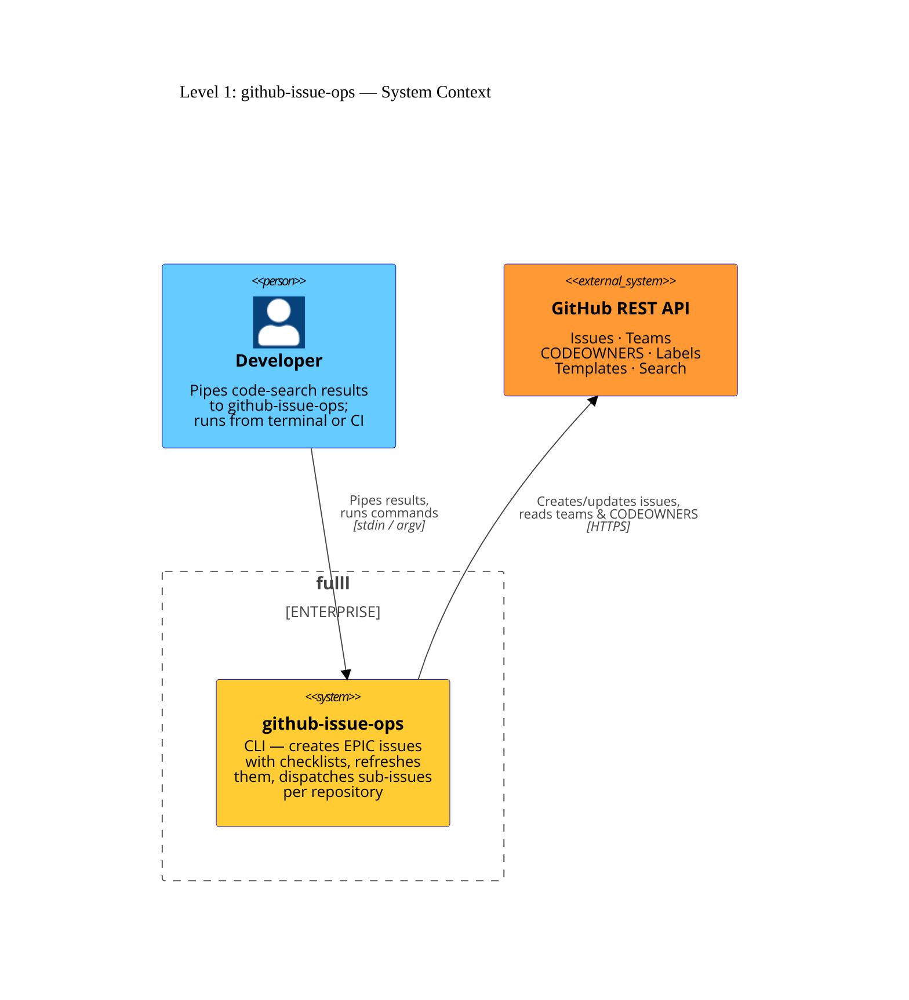

# Level 1: System context

`github-issue-ops` is a self-contained command-line tool. It mediates between
a developer and the GitHub REST API: the developer pipes code-search results
to the tool, which creates a structured **EPIC** issue in a central repository,
then dispatches one sub-issue per repository found.

The diagram below shows the two actors and the single external dependency.

## Actors

| Actor               | Description                                                                                                               |
| ------------------- | ------------------------------------------------------------------------------------------------------------------------- |
| **Developer**       | The person (or CI job) that invokes the tool. Provides a `GITHUB_TOKEN` and pipes `github-code-search` output to stdin.   |
| **GitHub REST API** | The only external system. Used for issue CRUD, labels, templates, org-team listing, CODEOWNERS, and issue search (dedup). |

## Authentication

The tool reads `GITHUB_TOKEN` (or `GH_TOKEN`) from the environment. The recommended OAuth scopes are:

- `repo` — read/write issues and repository contents (CODEOWNERS)
- `read:org` — org team listing (required for `--team-prefixes` ownership)
